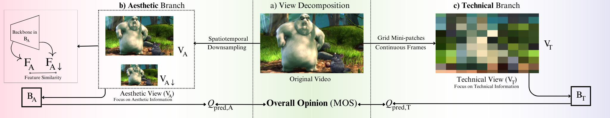

## Portfolio

---
## Projects 

[Analysis of Video Quality Assessment methods](/images/Copy of Analyzing Video Quality Assessment Methods' Performance on Animation Videos.pdf)

For my research project, I analyzed the content-oriented VQA methods on computer graphics (CG) videos and compared their performance to the traditionally used VQA methods. In conclusion, content-oriented VQA methods better align with human perception of video quality than traditional VQA methods. Refer to the link for more.

---
[Peer Review Scheduler](https://bachelorshowcase-eemcs.apps.utwente.nl/view/CsIPd3Qj)

A web application that allows the user to automate, speed up, and process schedule creation.

---
[JCC Software Application](https://github.com/Jurredr/TMAManager)

A web application in which the user can easily apply the corporate identity of a municipality to the application.

---
Graph Automorphism and Isomorphism Counter

In subquadratic time, count the number of automorphisms of a graph or isomorphisms between graphs.

---

Page template forked from <a href="https://github.com/evanca/quick-portfolio">evanca</a>

<!-- Remove above link if you don't want to attibute -->
